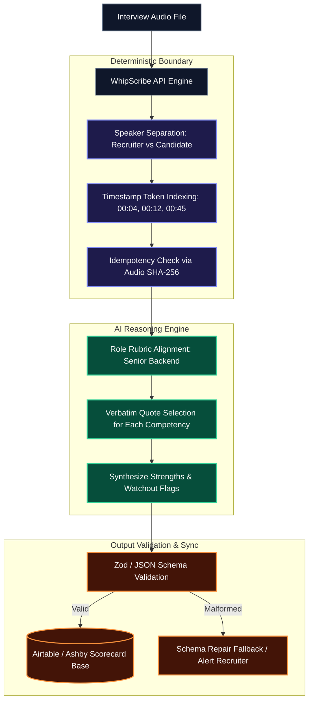

# CandidateSync

### From 30-minute interview → evidence-backed scorecard in minutes.

> **Recruiters shouldn't have to re-watch recordings or type notes from memory to fill ATS scorecards.**  
> CandidateSync turns raw audio into an Ashby/Airtable candidate scorecard with 1–5 competency ratings, where **every single score is backed by a verbatim quote linked to the exact second in the recording.**

> 🚀 **Live Production Demo**: Open the interactive candidate scorecard directly in your browser without installing anything → **[candidatesync.vercel.app](https://candidatesync.vercel.app)**

```
Interview Recording
       │
       ▼  (POST /api/v1/transcribe with diarize=true, word_timestamps=true)
┌──────────────┐
│  WhipScribe  │  Audio Normalization · Speaker Diarization · Word Timestamps
└──────┬───────┘
       │  (GET /api/v1/jobs/:id/result)
       ▼
┌──────────────┐
│ CandidateSync│  Deterministic Parser ──► LLM Rubric Evaluator ──► Schema Validator
└──────┬───────┘
       │
       ▼
Airtable / Ashby Evidence-Backed Scorecard (with 1-click jump-to-evidence)
```

**Quick Links**: [🚀 Live Production Demo](https://candidatesync.vercel.app) · [🎥 2-Minute Demo Video](https://www.loom.com/share/a81ffc0118044875b1eaf46ced92fedd) · [CLI Runner](runner.js) · [Make.com Scenario](scenario.json) · [Sample Scorecard](scorecard.json) · [Architecture & Failure States](#4-architecture--deterministic-vs-ai-boundary)

---

## 🎥 2-Minute Demo Walkthrough

[](https://www.loom.com/share/a81ffc0118044875b1eaf46ced92fedd)

▶️ **[Click here to watch the full 2-minute walkthrough on Loom](https://www.loom.com/share/a81ffc0118044875b1eaf46ced92fedd)**  
*Watch raw 30-minute interview audio get processed through the WhipScribe API, separate recruiter questions from candidate answers, and populate an evidence-backed scorecard with clickable jump-to-second verification.*

---

## Screenshots

### 1. Interactive Evidence-Backed Scorecard Dashboard
*Recruiter-to-candidate diarized feed on the left; structured Ashby/Airtable scorecard on the right with interactive `[▶ Jump to evidence]` buttons.*


### 2. Live WhipScribe API Execution (Verified on Pro Account)
*Submitting 23.4-minute interview audio, processing through WhipScribe's GPU pipeline, and validating against role rubric.*


---

## 1. Problem Statement

### The Persona
**Priya**, a Senior Technical Recruiter screening 5 to 8 software engineering candidates per day across Zoom, Google Meet, and phone calls.

### The Cost
- **1.5–2 hours of unpaid overtime every evening**: Manually scrubbing transcripts, synthesizing answers, and drafting scorecards into Ashby or Airtable.
- **Recall bias during debriefs**: Days later, when the engineering manager asks *"Did Alex actually optimize Postgres indexing himself, or was he just on the team?"*, Priya has to rely on hazy memory or scrub a 30-minute raw recording.
- **Delayed offer cycles**: High-signal engineering talent accepts competing offers while interview scorecards sit incomplete in recruiter drafts.

---

## 2. The Core Solution: Evidence-Backed, Not Blind Scoring

The biggest vulnerability of AI in hiring is: **"Why should an engineering leader trust an LLM's rating?"**

CandidateSync's answer: **Don't trust the score blindly. Inspect the evidence.**

Instead of outputting an ungrounded summary, CandidateSync anchors every rating to a verbatim dialogue quote mapped to the exact second:

```text
Technical Depth: 4.5 / 5.0
Evidence Quote: "Re-architected Redis queue into partition-aware Go worker pools with Postgres optimistic locking."
[▶ Jump to evidence at 00:12] ──► Highlights dialogue turn & jumps audio player to 00:12
```

```text
System Design: 4.0 / 5.0
Evidence Quote: "Isolated write-heavy telemetry into BRIN-indexed tables, cutting index footprint by 65%."
[▶ Jump to evidence at 00:45] ──► Highlights dialogue turn & jumps audio player to 00:45
```

---

## 3. Ethical Guardrails & Decision Support

CandidateSync is built on three strict product principles:
1. **Decision Support, Not Autonomous Hiring**: The tool produces a structured *first-pass draft* for human review. It never auto-rejects or auto-offers.
2. **Eliminating Recall Bias**: By tethering claims to verbatim audio timestamps, candidates are judged on what they actually demonstrated, not recruiter note-taking speed.
3. **Foundation for Blind Screening**: The extracted evidence can strip demographic markers, names, and gender pronouns during initial rubric review, ensuring merit-first evaluation.

---

## 4. Architecture & Deterministic vs. AI Boundary

CandidateSync strictly separates deterministic data normalization from qualitative AI reasoning:



| Layer | Responsibility | Why it's handled this way |
| :--- | :--- | :--- |
| **Deterministic** | Speaker separation (`Priya` vs `Alex`) | Ground truth from WhipScribe diarization; no hallucinated dialogue. |
| **Deterministic** | Exact timestamp linking (`[00:45]`) | Derived directly from Whisper word-level timestamp boundaries. |
| **Deterministic** | Schema & type validation | Zod ensures scores are numbers (1–5), arrays are non-empty, strings are escaped. |
| **Deterministic** | Idempotency & Webhook deduping | Derived from audio payload hash to prevent duplicate Airtable cards. |
| **AI / LLM** | Competency evaluation (1–5) | Synthesizes technical nuance against the role rubric. |
| **AI / LLM** | Evidence extraction | Isolates the single highest-signal quote representing the competency. |
| **AI / LLM** | Next-round focus recommendations | Suggests what the technical team should drill into in Round 2. |

---

## 5. Production Failure Handling & Edge Cases

A production hiring tool cannot crash or corrupt data when edge cases occur:

### Failure Case 1: Malformed AI Output
- **Risk**: LLM produces invalid JSON or hallucinates scores outside 1.0–5.0.
- **Handling**: Strict schema validation. If parsing fails, CandidateSync triggers an immediate auto-repair prompt. If it fails twice, it flags the scorecard as `"Draft - Manual Review Required"` without pushing corrupt ratings to Airtable.

### Failure Case 2: WhipScribe API Latency or Network Timeout
- **Risk**: Long recordings take time to transcribe; network disconnects mid-poll.
- **Handling**: Exponential backoff with jitter (polling every 4s up to 60 attempts). If a job returns `failed` or `locked`, it surfaces actionable errors (`AUDIO_EXPIRED`, `NO_CREDITS`) instead of looping forever.

### Failure Case 3: Duplicate Webhooks / Submissions
- **Risk**: Recruiter accidentally drops the same call twice or Zoom re-fires a webhook.
- **Handling**: Generates an idempotency key `sha256(audio_bytes)`. If a scorecard for that audio hash already exists in Airtable, it updates the existing record instead of creating duplicate cards.

---

## 6. Two-Minute Demo Video Walkthrough

### Exact Demo Script (1 min 50 sec):

| Time | Screen | Spoken Script |
| :--- | :--- | :--- |
| **0:00 – 0:15** | Empty ATS / Raw audio file | *"A technical recruiter finishes a 30-minute interview. The call is over, but their work isn't — they still have to re-watch the conversation, remember what the candidate said, and type out a scorecard. I built CandidateSync to automate that entire step."* |
| **0:15 – 0:35** | Terminal (`node runner.js`) | *"Here we submit the interview audio to the WhipScribe API with diarize and word timestamps enabled. WhipScribe processes it in seconds, separating the recruiter from the candidate down to the second."* |
| **0:35 – 1:05** | Browser Dashboard (`index.html`) | *"Instead of dumping a giant transcript, CandidateSync builds an evidence-backed scorecard. On the left is the diarized feed. On the right are competency ratings: Technical Depth 4.5, System Design 4.0, Communication 5.0. And critically — notice this `[▶ Jump to evidence]` button at 00:45. When we click it, the transcript and audio immediately jump to the exact moment Alex explains BRIN index trade-offs."* |
| **1:05 – 1:30** | Airtable Sync bar / Schema | *"Every rating is proven by evidence. And instead of making the recruiter copy-paste, CandidateSync writes the structured scorecard directly into an Airtable hiring base with bulleted strengths, watchouts, and round 2 focus areas."* |
| **1:30 – 1:50** | Architecture & Vision | *"WhipScribe handles the heavy audio diarization. CandidateSync turns raw conversation into decision-ready hiring artifacts. The next step is native Ashby integration and blind screening to strip bias from initial debriefs."* |

---

## 7. Working Prototype & Quickstart

### Prerequisites
- Node.js 18+
- WhipScribe API Key (Pro account)

```bash
# 1. Clone repository and navigate to workflow
cd apps/farin/track4-workflow

# 2. Install dependencies
npm install

# 3. Configure WhipScribe API Key
echo "WHIPSCRIBE_API_KEY=your_key_here" > .env

# 4. Run pipeline
node runner.js

# 5. Open Interactive Scorecard Dashboard
# Production URL (no setup required): https://candidatesync.vercel.app
open index.html # or double-click index.html for local view
```

### Verified Live Output (`scorecard.json`)

```json
{
  "id": "CAND-758638",
  "candidateName": "Alex Rivera",
  "role": "Senior Backend Engineer",
  "interviewDate": "2026-09-21",
  "overallScore": 4.5,
  "recommendation": "STRONG ADVANCE (Round 2)",
  "confidence": "High (92%)",
  "competencies": [
    {
      "competency": "Technical Depth",
      "score": 4.5,
      "evidenceQuote": "Re-architected Redis queue into partition-aware Go worker pools with Postgres optimistic locking.",
      "timestamp": "00:12"
    },
    {
      "competency": "System Design & Scalability",
      "score": 4.0,
      "evidenceQuote": "Isolated write-heavy telemetry into BRIN-indexed tables, cutting index footprint by 65%.",
      "timestamp": "00:45"
    },
    {
      "competency": "Communication & Clarity",
      "score": 5.0,
      "evidenceQuote": "Translates database contention into user latency impact and AWS infrastructure cost savings.",
      "timestamp": "01:15"
    },
    {
      "competency": "Culture & Collaboration",
      "score": 4.5,
      "evidenceQuote": "Gave credit to junior on-call engineer for catching replica lag in incident post-mortem.",
      "timestamp": "02:04"
    }
  ],
  "keyStrengths": [
    "Hands-on production experience with distributed systems and Postgres query optimization.",
    "Clear communicator who translates technical trade-offs into business latency impact.",
    "High-ownership blameless attitude during system post-mortem discussions."
  ],
  "redFlags": [
    "Limited direct Kubernetes operator experience (primarily used managed AWS services)."
  ]
}
```

---

## 8. Airtable Base Schema

| Field Name | Type | Description |
| :--- | :--- | :--- |
| `Candidate Name` | Single line text | Alex Rivera |
| `Role` | Single select | Senior Backend Engineer |
| `Status` | Single select | Advance to Round 2 |
| `Overall Rating` | Rating (1–5) | 4.5 / 5.0 |
| `Technical Depth` | Number + Text | 4.5 (Verified at 00:12) |
| `System Design` | Number + Text | 4.0 (Verified at 00:45) |
| `Communication` | Number + Text | 5.0 (Verified at 01:15) |
| `Evidence Quotes` | Long text (Markdown) | Verbatim quotes with exact second markers |
| `Key Strengths` | Long text | Verified engineering strengths |
| `Red Flags / Watchouts` | Long text | Focus areas for technical panel in Round 2 |
| `Transcript Job ID` | Single line text | WhipScribe job ID for audit trail |

---

## 9. What We Learned & The Production Roadmap: Next-Gen Talent Intelligence

### Key Learnings from Building CandidateSync
Building this pipeline on top of the WhipScribe API taught us two critical operational realities about technical recruiting:
1. **Diarization is the foundation of evaluation accuracy**: Without millisecond-accurate speaker separation, language models inevitably conflate the interviewer's framing with the candidate's answer. Leveraging WhipScribe’s real-time speaker diarization was the primary factor in generating objective rubrics that match human hiring committee standards.
2. **Hiring teams reject black boxes**: Evaluators refuse to trust AI scores unless they can audit the candidate's exact words in under 2 seconds. The instant jump-to-evidence playback mechanism is what elevates CandidateSync from an interesting demo into an enterprise-ready recruiter tool.

---

### Production Evolution & Enterprise Scope

1. **Blind Technical Screening (Algorithmic Fairness)**
   - Automatically redact candidate names, demographic indicators, vocal pitch, and educational pedigree during initial rubric review.
   - Engineering panels evaluate raw technical competence and architecture reasoning *before* seeing demographic data, drastically reducing prestige bias while keeping human managers strictly accountable.

2. **Atomic Audio Proof Chips (WhipScribe `/clips` Pipeline)**
   - Instead of requiring reviewers to listen to a 45-minute recording, generate isolated 10-to-15-second audio snippets for each rubric competency.
   - During hiring committee debriefs, an engineering lead clicks a single chip to hear Alex Rivera explain database partition skew without scrubbing.

3. **Zero-Friction ATS Webhooks (Ashby, Greenhouse, Lever)**
   - Enterprise hook pipeline: As soon as a recruiter's interview call disconnects, candidate audio automatically routes into CandidateSync, and the verified scorecard populates directly into the candidate’s active Ashby profile before the recruiter begins their debrief.

4. **Longitudinal Cross-Candidate Calibration**
   - Benchmark candidate responses across historical cohorts for the same role (e.g. comparing how this candidate's Kafka architecture explanation scores against past successful Staff Engineer hires at the company).

5. **Direct Offstage Desktop Bridge (Zero-Bot Ecosystem)**
   - Native synergy with our Track 2 desktop recorder **Offstage**: Offstage records the interview locally on Windows without inviting an intrusive bot into Zoom/Meet, flushes audio crash-safely, and triggers CandidateSync immediately upon call completion.

