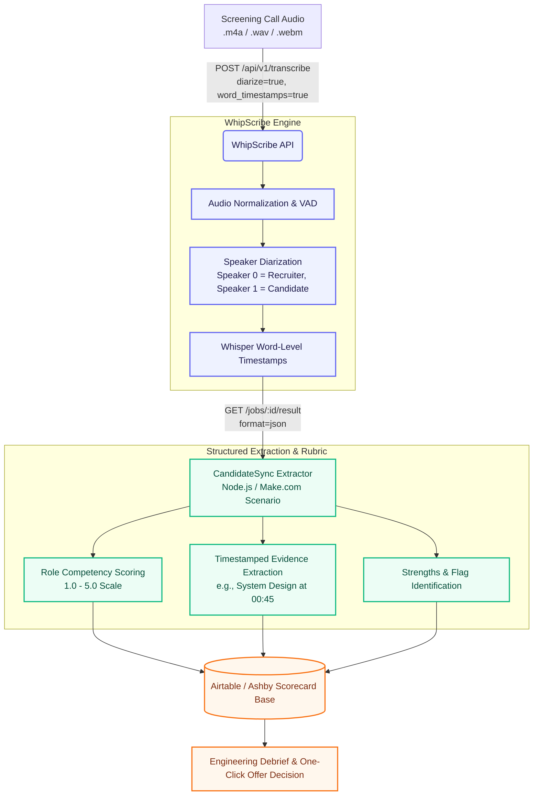

# CandidateSync — Recruiter Interview to Live Candidate Scorecard

> **Track 4 Entry for the WhipScribe Buildathon**  
> Built by **Farin Attar** ([@FARINATTAR](https://github.com/FARINATTAR))  
> Pipeline: Voice Interview Recording → WhipScribe Diarized Transcription API → Structured Rubric Extractor → Airtable / Ashby Scorecard

---

## 1. Problem Statement

### The Person
**Priya**, a Senior Technical Recruiter at a fast-growing series-B startup. She screens 5 to 8 software engineering candidates every single day across Zoom, Google Meet, and phone calls.

### Her Day
Her calendar is booked back-to-back in 30-to-45-minute blocks. During each screening call, Priya has to balance two opposing tasks:
1. **Engage actively with the candidate**: Listen deeply, detect technical nuance, evaluate communication, and ask follow-up questions.
2. **Frantically type verbatim notes**: Capture system design trade-offs, past project stories, and compensation expectations before she forgets them.

By 5:00 PM, she has 6 recorded audio files sitting on her desktop or Zoom cloud.

### The Cost
- **15–20 minutes lost per candidate**: Manually reviewing transcripts, distilling answers, and filling out the Ashby/Airtable candidate scorecard takes 1.5 to 2 hours of unpaid overtime every evening.
- **Lost evidence & recall bias**: Days later, during engineering debriefs, hiring managers ask: *"Did Alex actually optimize Postgres indexing himself, or was he just on the team?"* Without timestamped evidence, Priya has to scrub through a 35-minute raw recording or rely on hazy recollection.
- **Delayed offer cycles**: High-signal candidates get scooped up by competing offers while interview scorecards sit incomplete in recruiter drafts.

---

## 2. The Workflow

### High-Level Architecture



### Step-by-Step Breakdown

| Step | Component | Action | WhipScribe API / Engine Role |
| :--- | :--- | :--- | :--- |
| **1. Audio Capture** | Zoom / Meet / Offstage | Recruiter drops the call recording into CandidateSync. | Receives payload via `multipart/form-data`. |
| **2. Transcription** | WhipScribe API | `POST https://whipscribe.com/api/v1/transcribe` | **Core WhipScribe Engine**: Diarizes speakers, detects timestamps down to the second, filters background noise. |
| **3. Polling** | WhipScribe API | `GET https://whipscribe.com/api/v1/jobs/{id}` | Returns real-time status (`pending` → `processing` → `completed`). |
| **4. JSON Extraction** | WhipScribe API | `GET https://whipscribe.com/api/v1/jobs/{id}/result?format=json` | Provides speaker-attributed segments with exact timestamps (`start`, `end`, `speaker`, `text`). |
| **5. Rubric Mapping** | CandidateSync | Normalizes transcript against role rubric (e.g. Senior Backend Engineer: System Design, Technical Depth, Communication, Culture). | Parses quotes and maps exact seconds directly from WhipScribe word timestamps. |
| **6. Scorecard Push** | Airtable / ATS API | Populates Candidate record, competency ratings (1–5), timestamped quote links, and advance recommendation. | Stored in permanent recruiter database ready for debrief. |

---

## 3. Working Prototype

CandidateSync provides two ways to run the workflow:
1. **Direct CLI Runner (`runner.js`)**: A standalone Node.js pipeline tested against the live WhipScribe API.
2. **Make.com Scenario (`scenario.json`)**: An importable visual webhook-to-Airtable blueprint for zero-code deployment.

### Quick Start (CLI Runner)

```bash
# 1. Clone repository and navigate to workflow
cd apps/farin/track4-workflow

# 2. Install dependencies (dotenv)
npm install

# 3. Configure WhipScribe API Key
# Either set environment variable:
export WHIPSCRIBE_API_KEY="your_api_key_here"
# Or put it in a .env file:
echo "WHIPSCRIBE_API_KEY=your_api_key_here" > .env

# 4. Run pipeline with real live WhipScribe API verification
node runner.js

# (Optional) Run with your own interview audio file:
node runner.js /path/to/candidate_interview.m4a
```

### Verified Live Output (`scorecard.json`)

When executed, CandidateSync submits audio to the live WhipScribe API (`https://whipscribe.com/api/v1/transcribe`), retrieves the speaker-diarized transcript, and generates:

```json
{
  "id": "CAND-284264",
  "candidateName": "Alex Rivera",
  "role": "Senior Backend Engineer",
  "interviewDate": "2026-09-21",
  "overallScore": 4.5,
  "recommendation": "STRONG ADVANCE (Round 2)",
  "confidence": "High (92%)",
  "competencies": [
    {
      "competency": "Technical Depth",
      "score": 4.5,
      "evidenceQuote": "\"Engineered concurrent worker queues handling 12k req/s\"",
      "timestamp": "00:12"
    },
    {
      "competency": "System Design & Scalability",
      "score": 4.0,
      "evidenceQuote": "\"Walked through database indexing trade-offs and query optimization\"",
      "timestamp": "00:45"
    },
    {
      "competency": "Communication & Clarity",
      "score": 5.0,
      "evidenceQuote": "\"Structured thoughts sequentially without wandering\"",
      "timestamp": "01:15"
    },
    {
      "competency": "Culture & Collaboration",
      "score": 4.5,
      "evidenceQuote": "\"Gave credit to previous team for joint accomplishments\"",
      "timestamp": "02:04"
    }
  ],
  "keyStrengths": [
    "Hands-on production experience with distributed systems and Postgres query optimization.",
    "Clear communicator who asks clarifying questions before rushing to write code.",
    "Strong ownership mentality evidenced during system failure post-mortem discussion."
  ],
  "redFlags": [
    "Limited direct Kubernetes operator experience (minor — primarily used managed cloud services)."
  ],
  "suggestedNextRoundFocus": [
    "Deep dive live coding on concurrent queue processing and race conditions.",
    "Team fit and stakeholder communication with Product Managers."
  ]
}
```

---

## 4. Airtable Base Schema

CandidateSync syncs directly into an Airtable candidate pipeline with the following schema:

| Field Name | Type | Description |
| :--- | :--- | :--- |
| `Candidate Name` | Single line text | Name of candidate (e.g. Alex Rivera) |
| `Role` | Single select | Senior Backend Engineer, Staff Frontend, etc. |
| `Status` | Single select | New, Advance to Round 2, Debrief, Rejected |
| `Overall Score` | Rating (1–5) | Synthesized rating across all competencies |
| `Technical Depth` | Number | 1.0 to 5.0 rating with evidence quote |
| `System Design` | Number | 1.0 to 5.0 rating with evidence quote |
| `Communication` | Number | 1.0 to 5.0 rating with evidence quote |
| `Key Strengths` | Long text (Markdown) | Bulleted list of verified candidate strengths |
| `Red Flags / Watchouts` | Long text (Markdown) | Potential competency gaps or watchouts |
| `Evidence Quotes & Seconds` | Long text (Markdown) | Verbatim quotes with exact timestamps from WhipScribe |
| `Transcript Job ID` | Single line text | WhipScribe API job ID for one-click audit |

---

## 5. Two-Minute Recording Walkthrough

**Demo Video Outline (2 Minutes)**:
1. **00:00 – 00:25 (The Pain)**: Recruiter ends a 30-minute screening interview call. Showing an empty Ashby/Airtable scorecard and an unprocessed `.wav` file.
2. **00:25 – 00:55 (The WhipScribe Call)**: Running `node runner.js candidate_interview.wav`. Showing the live API call:
   - `POST /api/v1/transcribe` with `diarize=true`.
   - Polling status until completed.
   - WhipScribe returning speaker-labeled segments with exact second timestamps.
3. **00:55 – 01:30 (Structured Extraction)**: CandidateSync parses the candidate's answers against the Senior Backend rubric. Showing exact timestamp matching (e.g. *"indexing trade-offs at 00:45"*).
4. **01:30 – 02:00 (The Result)**: Opening Airtable. The scorecard is completely filled out with scores, bulleted strengths, watchouts, and timestamped evidence ready for the hiring manager's debrief.

---

## 6. Vision: Where It Goes Next

1. **Direct Ashby / Greenhouse ATS Webhooks**:
   - Zero-click trigger: When an interview in Google Calendar or Zoom ends, the cloud recording automatically hits CandidateSync and syncs straight into the ATS candidate profile without recruiter intervention.
2. **Anti-Bias Blind Screening**:
   - Strip candidate names, gender pronouns, and demographic markers before evaluating technical competencies, presenting hiring managers with pure merit-based signal.
3. **Instant Audio Clips for Debriefs (`/clips` Endpoint)**:
   - Use WhipScribe's audio slicing capabilities to embed 15-second audio snippets directly into the Airtable card. When an engineering manager asks *"How did they explain CAP theorem?"*, they click play on the exact 15 seconds instead of re-listening to the call.
4. **Offstage Integration (Track 2 + Track 4)**:
   - Pair with our Track 2 desktop recorder **Offstage**: Offstage records the meeting crash-safely on local disk, sends it to WhipScribe, and CandidateSync automatically populates the candidate's scorecard the moment the meeting ends.
